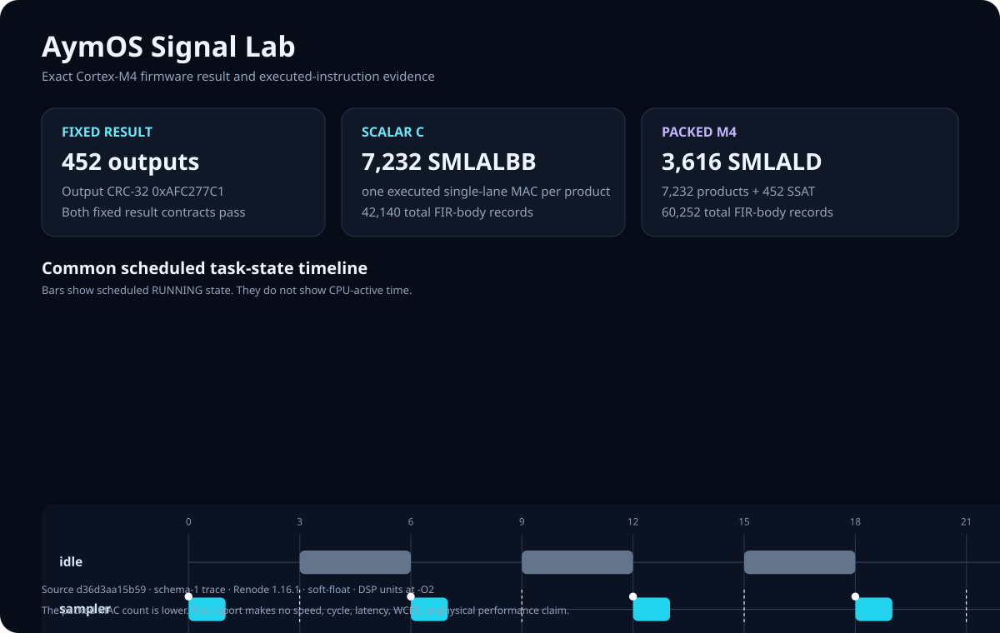

# AymOS

AymOS is a small Cortex-M4 real-time systems lab. It targets the
NUCLEO-F401RE board. It runs deterministic workloads in the Renode emulator.
It records kernel events for inspection on a Linux host.

AymOS uses Earliest Deadline First (EDF) scheduling. EDF selects the ready
task with the earliest absolute deadline. A fixed priority resolves an equal
deadline.

The Signal Lab uses digital signal processing (DSP). DSP applies numeric
operations to sampled data. The lab uses Q15 values. Q15 stores a signed
fraction in a 16-bit integer.



The image shows functional instruction evidence from one validated run. It
does not show speed, cycles, latency, worst-case execution time (WCET), or
physical performance. See the [machine-readable result](docs/assets/signal-lab.json).

## Quick start

Use a Linux x86-64 host. Do not install a global Arm compiler or Renode.

Install the pinned project tools:

```sh
make setup
```

Run the Deadline Lab:

```sh
make demo
```

Run the Signal Lab and create its comparison report:

```sh
make demo-dsp
```

Run the native and host checks:

```sh
make test
```

`make setup` installs tools under `.tools/` and source dependencies under
`.deps/`. The dependency lock records the source revisions and archive hashes.

## Verified

The project verifies these functions:

- The build creates a Cortex-M4 soft-float ELF, binary, map, size report, and
  build metadata for the NUCLEO-F401RE.
- The firmware starts with the vendor vector table and linker memory map.
- Kernel tasks use SVC, PendSV, the Process Stack Pointer (PSP), SysTick, and
  EDF dispatch.
- Task tests cover first dispatch, yield, preemption, sleep, wake, return,
  deferred stack reclaim, and task-slot reuse.
- Scheduler tests cover deadline order, priority ties, periodic release,
  deadline misses, idle selection, and tick wraparound.
- Allocator tests cover alignment, split, exact fit, coalescing, exhaustion,
  invalid free, task ownership, and fragmentation statistics.
- Schema-1 trace tests cover all event types, loss detection, bounds,
  corruption, and exact deterministic event sequences.
- The Deadline Lab creates normal and overload reports from two exact firmware
  runs. The overload mode records a repeatable deadline miss.
- The Signal Lab runs scalar and packed DSP firmware images. Both
  implementations produce 452 outputs and pass the fixed output CRC-32
  contract `0xAFC277C1`.
- The Signal Lab records 7,232 executed single-lane `SMLALBB` instructions in
  the scalar FIR body. It records 3,616 executed packed `SMLALD` instructions
  and 452 `SSAT` instructions in the M4 FIR body.

The pinned Renode environment supplies functional emulator evidence. These
checks do not prove physical timing or hard real-time behavior.

## Experimental

These parts have a narrow, tested scope:

- The local Renode platform models the CPU, memory, NVIC, SysTick, USART2, and
  the GPIO behavior that the current workloads need.
- The allocator is an educational first-fit/next-fit heap for kernel tasks. It
  is not a general C library allocator.
- Allocation ownership is bookkeeping. It is not hardware memory protection.
- Trace events change guest work. Use them to explain order and state, not
  timing.
- Signal Lab execution tracing is bounded and synchronous. It proves that the
  selected instructions ran in each exact ELF.

## Planned

The next milestone can add a recorded physical-board run. It can compare
hardware cycle counts with the current functional evidence.

The project does not yet plan a shell, networking, a file system, USB,
multiple architecture ports, symmetric multiprocessing, or POSIX support.
These features do not support the current lab goals.

## Hardware not validated

The current campaign did not use a physical NUCLEO-F401RE board. `make flash`
builds the image and then stops with this notice. It does not claim a hardware
test.

The project does not claim physical interrupt latency, execution time, WCET,
or a hard real-time guarantee. Record a board, probe, clock setup, compiler,
firmware hash, and measurement method before you make such a claim.

## Kernel path

The kernel uses a small exception path:

1. SVC starts the first task on PSP.
2. SysTick advances the kernel tick and releases due tasks.
3. EDF selects a ready task.
4. PendSV saves and restores the software context.
5. Exception return restores the hardware frame.
6. A task trampoline sends a returned task to `osTaskExit()`.
7. The idle task runs when no user task is ready.

The firmware uses the Main Stack Pointer (MSP) for handlers. It uses PSP for
tasks. Task stacks keep eight-byte alignment. The firmware uses the soft-float
application binary interface. The kernel does not preserve a floating-point
context.

## Labs

### Deadline Lab

Deadline Lab uses a sampler, controller, telemetry task, load task, and idle
task. Normal mode meets all configured deadlines. Overload mode increases
deterministic work and records the first miss.

Run both modes:

```sh
make demo
```

The command creates a unique directory under `runs/`. Each mode stores its
firmware, map, workload, metadata, UART data, trace, summary, log, and
standalone HTML timeline. The tool retains a bounded number of complete runs.

See [Deadline Lab details](docs/DEADLINE_LAB.md).

### Signal Lab

Signal Lab uses a sampler, processor, verifier, and idle task. The sampler
creates four fixed 128-sample frames. The processor applies a 16-tap finite
impulse response (FIR) filter. The verifier checks the result inside the
firmware.

Run and report both implementations:

```sh
make demo-dsp
```

Create a new report from existing validated evidence:

```sh
make report-dsp
```

The report copies and hashes the exact evidence before it publishes a complete
run. It rejects an incomplete result, an unknown file, a changed byte count, a
changed hash, a different result, or a different structured trace.

The packed loop halves the multiply-accumulate (MAC) instruction count. It
processes two signed Q15 products with each `SMLALD`. The first M4 function has
more total executed FIR-body instruction records than the scalar function.
This evidence does not establish a whole-function efficiency gain.

See [Performance Lab details](docs/PERFORMANCE_LAB.md).

## Common commands

Build the boot image:

```sh
make firmware
```

Boot the image and print USART2 output:

```sh
make run
```

Run one boot test:

```sh
make test-emulator
```

Run all native C tests with sanitizers:

```sh
make test-native
```

Check the Cortex-M4 DSP object code:

```sh
make check-dsp-codegen
```

Run one Signal Lab firmware configuration:

```sh
make run-signal-lab SIGNAL_IMPL=m4
```

Run one Deadline Lab build configuration:

```sh
make deadline-lab WORKLOAD_MODE=overload
```

Run a repeated manual emulator gate when you need it:

```sh
RENODE_REPEAT=5 make test-edf
```

See [build instructions](docs/BUILDING.md) for all targets and artifact paths.

## Repository layout

```text
apps/       Board-targeted lab applications
arch/       Cortex-M4 context-switch assembly
bsp/        NUCLEO-F401RE startup support, board code, and linker script
dsp/        Allocation-free Q15 FIR code
kernel/     Scheduler, task lifecycle, allocator, and structured trace
platform/   Local Renode platform and launch scripts
tests/      Native, host, and emulator checks
tools/      Setup, validation, trace, and report tools
docs/       Build, lab, design, and evidence documents
```

## Application selection

The Makefile uses controlled source lists. Select an application with `APP`:

```sh
make APP=boot firmware
make APP=lifecycle firmware
make APP=edf firmware
make APP=allocator firmware
make APP=trace firmware
make APP=deadline_lab WORKLOAD_MODE=normal firmware
make APP=signal_lab SIGNAL_IMPL=scalar firmware
```

The canonical target is `BOARD=nucleo_f401re`.

## Design documents

- [Implementation plan](docs/IMPLEMENTATION_PLAN.md)
- [Build and dependency guide](docs/BUILDING.md)
- [Functionality overview](docs/FUNCTIONALITY_OVERVIEW.md)
- [Trace format and schema](docs/TRACE_FORMAT.md)
- [Deadline Lab](docs/DEADLINE_LAB.md)
- [Performance Lab](docs/PERFORMANCE_LAB.md)
